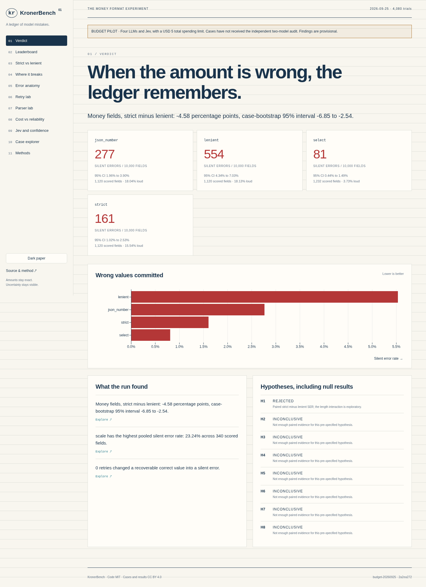
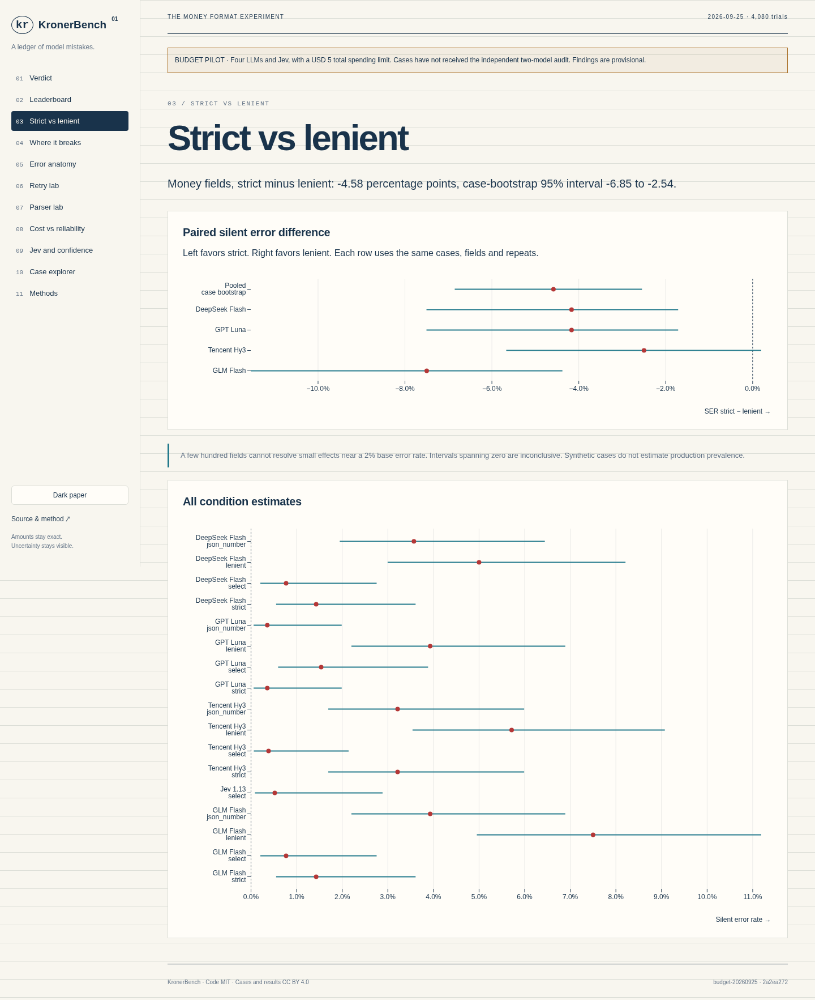
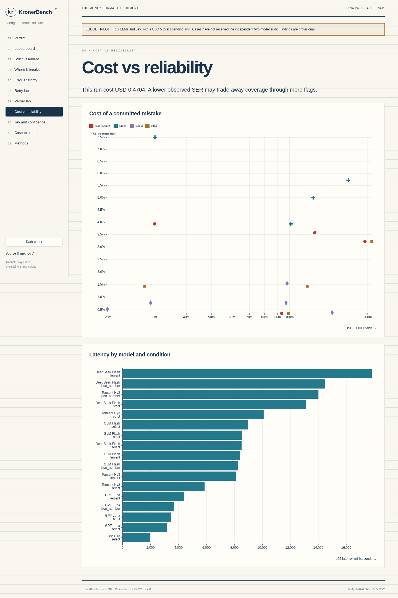

# KronerBench

**How often does an LLM put the wrong money amount in a ledger?**

[](https://github.com/AgaasNO/kronerbench/actions/workflows/ci.yml)

[](LICENSE)
[](LICENSE-DATA)

KronerBench compares strict amount formats with deterministic locale parsing,
verbatim copying, JSON numbers and selection from extracted candidates. Its main
metric is the **silent error rate**: wrong values actually committed through tools.
Rejected values are counted separately.

[](https://agaasno.github.io/kronerbench/)

The **budget pilot cost USD 0.4719 including its smoke test**, below the USD 5 cap.
It covers 240 cases, four economical LLMs and Jev, with 3,980 applicable trials
and no API failures. One hundred selection cells are n/a because they concern words.
These are **provisional findings**. The independent two-model case audit is still pending,
and this smaller experiment does not establish results for frontier models.

[Interactive report](https://agaasno.github.io/kronerbench/) ·
[Raw run and offline report](https://github.com/AgaasNO/kronerbench/releases/tag/budget-pilot-20260925) ·
[Frozen analysis plan](ANALYSIS_PLAN.md)

## Pilot findings

- Money fields, strict minus lenient: -4.58 percentage points, case-bootstrap 95% interval -6.85 to -2.54.
- scale has the highest pooled silent error rate: 23.24% across 340 scored fields.
- 0 retries changed a recoverable correct value into a silent error.

These findings are copied from [summary.json](results/budget-summary.json) and checked
by a test. The primary comparison includes money fields only. Rates and dates are
secondary results. Intervals describe this synthetic sample, not production prevalence.

## The problem in 30 seconds

`1.234,50`, `1,234.50` and `1 234,50` can all denote the same money amount.
A model can change a digit while converting the punctuation. A parser can also
accept a perfectly copied number and store the wrong value. Both mistakes can
look like successful tool calls.

KronerBench records the source, raw tool arguments, validator decisions and final
commitment. You can inspect an error all the way back to the document.

## Try it locally

```sh
uv sync --dev
uv run kronerbench parse 'kr 1.234,50-'
uv run kronerbench run --profile quick --dry-run --run-id fixture
uv run kronerbench report fixture --open
```

The parser returns `accepted: true`, `value: -123450`, `sign: -1`. Monetary values
are integer minor units, so `-123450` means minus 1,234.50 kroner.

A parser-only trap:

```sh
uv run kronerbench parse '1,234.50'                 # value: 123450
uv run kronerbench parse '1,234.50' --parser naive  # value: 123
```

The naive parser removes the decimal dot. This example is a deterministic parser
calculation, not a claim about model behavior.

To run the cheaper profile from a source checkout:

```sh
uv sync --dev
export OPENROUTER_API_KEY='your-key'
uv run kronerbench estimate --profile budget
uv run kronerbench run --profile budget --max-cost 5
uv run kronerbench report latest --open
```

The budget profile uses GPT-5.6 Luna, DeepSeek V4.1 Flash, GLM 5.3 Flash, Tencent Hy3
and Jev 1.13. The LLM conditions are strict, lenient, JSON number and select;
Jev runs select only. It reserves request costs before sending calls and stops at the cap.
Actual costs vary. Its default estimate was USD 3.34; short responses made this run cheaper.
The original standard profile estimated USD 102.70 and remains outside the new budget.
Never commit a key.

## What's tested

| Suite | Cases | Main trap |
| --- | ---: | --- |
| Norwegian formats | 60 | `kr 12 500,--` |
| European formats | 70 | `49:-`, `€1,234.50`, `CHF 1'234.50` |
| Ambiguity | 30 | Unresolved totals and separators |
| Accounting notation | 25 | Parentheses, trailing minus and `CR` |
| Scale | 25 | `TNOK`, `MNOK`, `mrd.` |
| Words | 25 | Danish *halvfems*, Norwegian long-scale *billion* |
| Unicode | 25 | Invisible characters and unusual spaces |
| Long numbers | 40 | Repeated digits and internal zeros |
| Distractors | 30 | Identifiers beside the amount |
| Documents | 40 | Multi-field invoices and hotel folios |
| Percent | 45 | Fractions, percent, per mille and basis points |
| Dates | 30 | Day/month order |
| Derived, opt-in | 25 | Requested arithmetic |

The catalogue has 470 cases and 548 fields. It includes 180 authored traps and
290 generated cases. Synthetic identifiers are explicitly marked test data.
Every authored case includes its rationale.

## Conditions

| Condition | Tool value | Acceptance |
| --- | --- | --- |
| `strict` | String such as `1234,56` | Canonical regex |
| `strict_constrained` | Same string, schema pattern | Provider support required |
| `lenient` | Normally formatted amount | Deterministic safe parser |
| `verbatim` | Source substring | Safe parser and number-boundary provenance |
| `json_number` | Raw JSON number | Decimal decoding, whole minor units |
| `minor_units`, opt-in | Integer | Smallest currency unit |
| `select` | Candidate id | Deterministically extracted candidate |

Jev is a decision model. It only participates in selection and optional verification.
Its adapter preserves confidence, probabilities and the dated model snapshot.
The pilot chooses its threshold on calibration cases and reports Jev headline scores
on held-out evaluation cases. The verifier is outside this budget profile.

## Pilot results

This table includes money, rate and date fields. Jev includes evaluation cases only.
Read silent errors alongside loud failures: a model that flags everything records no
wrong values but does not complete the bookkeeping task.

| Model | Condition | Silent error rate, 95% CI | Loud rate | Fields |
| --- | --- | ---: | ---: | ---: |
| `deepseek/deepseek-v4.1-flash` | `json_number` | 3.57% [1.95, 6.45] | 13.93% | 280 |
| `deepseek/deepseek-v4.1-flash` | `lenient` | 5.00% [3.00, 8.22] | 15.71% | 280 |
| `deepseek/deepseek-v4.1-flash` | `select` | 0.77% [0.21, 2.76] | 2.69% | 260 |
| `deepseek/deepseek-v4.1-flash` | `strict` | 1.43% [0.56, 3.61] | 16.07% | 280 |
| `openai/gpt-5.6-luna` | `json_number` | 0.36% [0.06, 1.99] | 23.93% | 280 |
| `openai/gpt-5.6-luna` | `lenient` | 3.93% [2.21, 6.90] | 21.07% | 280 |
| `openai/gpt-5.6-luna` | `select` | 1.54% [0.60, 3.89] | 1.92% | 260 |
| `openai/gpt-5.6-luna` | `strict` | 0.36% [0.06, 1.99] | 17.86% | 280 |
| `tencent/hy3` | `json_number` | 3.21% [1.70, 5.99] | 25.71% | 280 |
| `tencent/hy3` | `lenient` | 5.71% [3.55, 9.08] | 25.71% | 280 |
| `tencent/hy3` | `select` | 0.38% [0.07, 2.15] | 1.92% | 260 |
| `tencent/hy3` | `strict` | 3.21% [1.70, 5.99] | 26.07% | 280 |
| `typesafe/jev-1.13` | `select` | 0.52% [0.09, 2.89] | 11.46% | 192 |
| `z-ai/glm-5.3-flash` | `json_number` | 3.93% [2.21, 6.90] | 8.57% | 280 |
| `z-ai/glm-5.3-flash` | `lenient` | 7.50% [4.96, 11.19] | 10.00% | 280 |
| `z-ai/glm-5.3-flash` | `select` | 0.77% [0.21, 2.76] | 2.69% | 260 |
| `z-ai/glm-5.3-flash` | `strict` | 1.43% [0.56, 3.61] | 2.14% | 280 |





For an application, track wrong commitments and rejected values separately. This
pilot does not support assuming that lenient parsing always reduces silent errors.
See the report's Parser lab for parser-only differences on identical model outputs.

## Inspect and reproduce

```sh
uv run kronerbench cases stats --json
uv run kronerbench cases show no-formats-0001
uv run kronerbench explain no-formats-0001 --run fixture
uv run kronerbench score fixture
uv run kronerbench export fixture --format parquet
uv run kronerbench selfcheck --skip-live
```

A run contains its case snapshot, manifest, complete request/response bodies in
SQLite, trial JSONL, field CSV/Parquet and summary JSON. Re-scoring costs nothing.
The report works from `file://` with no server or CDN.

`--help` on every command includes examples and cost notes. Exit codes are 0 for
success, 2 for usage errors, 3 for credentials, 4 for the cost cap, 5 for failed
acceptance checks, and 6 for provider unavailability.

## Develop and extend

Add a model to `config/models.yaml`, an authored case to `cases/handwritten/`,
or a format to `src/kronerbench/cases/styles.py`. Include a hand-calculated test
for each new format. A condition owns a prompt, schema and validator in
`src/kronerbench/conditions/core.py`. New suites also need a count and an explicit
sampling and scoring policy.

```sh
uv run pytest --cov=kronerbench.parsers --cov-branch --cov-report=json
uv run ruff check .
uv run mypy
pnpm --dir ui install
pnpm --dir ui build
pnpm --dir ui qa
```

The prebuilt UI ships with the Python source. Node is needed only to rebuild it.
Live contract tests require both `OPENROUTER_API_KEY` and `KRONERBENCH_LIVE=1`.

## Method and limitations

SER excludes API failures and counts flagged or rejected recoverable values as loud
failures. Currency errors have a separate column. Wilson intervals accompany rates;
paired comparisons use exact McNemar tests with Holm correction, and pooled
comparisons resample cases. Small samples cannot establish small differences near
a low base error rate.

Cases are synthetic and balanced across traps, so their error rate does not estimate
production prevalence. Provider routing, model updates, prompt wording and prices
can change results. The pilot analysis plan was committed before paid trials;
the independent case audit remains pending. The report marks untested hypotheses
inconclusive. The larger standard study and optional verifier remain unfinished;
see [implementation status](docs/STATUS.md). Fixture output is never research evidence.

## Prior work and licence

- Singh & Strouse, [Tokenization counts](https://arxiv.org/abs/2402.14903).
- Tam et al., [Let Me Speak Freely?](https://arxiv.org/abs/2408.02442), and the [dottxt response](https://blog.dottxt.ai/say-what-you-mean.html).
- Park et al., [Grammar-Aligned Decoding](https://arxiv.org/abs/2405.21047).
- [OpenRouter Jev tutorial](https://openrouter.ai/docs/guides/community/jev-tutorial).

Code is MIT. Cases and published results are CC BY 4.0. See [CITATION.cff](CITATION.cff).
